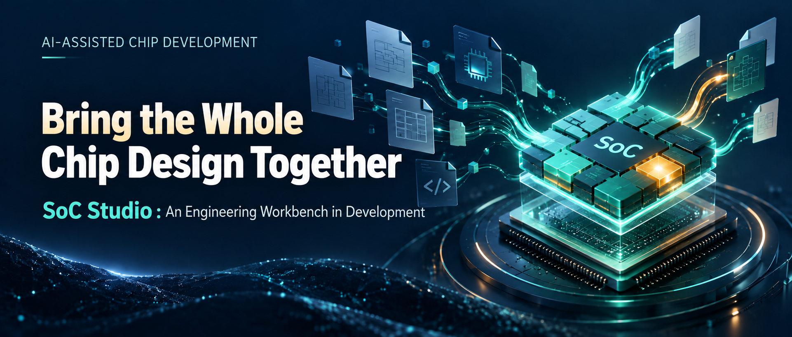

# SoC Studio: Bringing the Whole Chip Design Together

[简体中文](README.md) | English

*An engineering workbench connecting IP, system integration, code generation, and verification, starting with visual design.*

> **This project is under development. This is not a mature-product launch.** The article describes both implemented capabilities and the broader product vision. Planned capabilities are not promises of current availability. Aurora has automated checks for non-EDA source integration; RTL compilation, simulation, synthesis, and boot validation have not been completed.

Adding a UART to a SoC sounds straightforward.

Find the IP, connect the bus, assign an address range—and then? Where does its clock come from? Who controls reset? Which interrupt number does it use? Do its pins go through a pin multiplexer or to the parent module? If code generation is required, which configuration does the script read, and is the RTL in the output directory actually from this run?

Engineers know how to do this. The routine is familiar: open several files, compare a table, run a script, and inspect the top level again.

The difficulty is that the complete system often exists only in the mind of the person who remembers how all those pieces relate.

SoC Studio starts by making those relationships explicit. It is a browser-based SoC integration workbench that organizes IP, parameters, connections, and generation around one project.

The cost we want to reduce is the repeated expression and checking of the same design decision. If an address changes, does the generator know? If a parameter changes, are the ports still correct? Can the next engineer tell which outputs remain valid?

The current work converts these relationships into data that can be saved and checked. That can expose errors earlier, support IP reuse, reduce dependence on verbal handovers, and provide reliable inputs for later automation. Any efficiency gain needs measurement in real projects; we do not assume a percentage.

> **Screenshot pending 01 — Aurora BUS canvas.**
>
> Caption: A SoC should be understandable without mentally combining several scripts.

## Why put an engineering workbench in a browser?

A browser offers a common place to inspect the same system through different views. A canvas shows relationships, forms configure instances, tables inspect addresses, and logs explain failures. Moving from a module to its parameters, a connection to its endpoints, and a task to its outputs should feel continuous.

It also separates the interaction location from the execution environment. The browser handles interaction; the backend stores projects, validates changes, and invokes scripts and tools. Today both can run locally. In the future, compute and licensed tools could remain on designated workstations or servers behind controlled access. That requires authentication, isolation, scheduling, and auditing—planned capabilities that the current local service does not provide.

The same separation leaves room for Tcl, command-line use, and continuous integration, or CI. Browser interaction should not limit automation.

A web interface therefore does not imply zero installation, RTL executing inside the browser, or mandatory cloud storage. Backend and tool dependencies still need installation, and projects can stay local. The aim is a consistent interaction layer with an independently evolving execution environment.

## A drawn connection has to mean something

Users of Vivado Block Design will recognize the sequence: find an IP, place it, configure it, and connect its interfaces.

SoC Studio draws on that continuous workflow. For a system assembled from different IP sources and generators, however, drawing boxes is only the beginning.

Every wire must identify real endpoints, directions, and compatible widths. Every parameter change must account for altered ports and existing connections.

The canvas is an entry point into the engineering model. Instances bind specific IP versions; parameters belong to instances; address and interrupt relationships belong to the project. Moving a block changes its position. Changing a parameter has engineering consequences that must be addressed.

The canvas should let the designer interact with the project itself.

## Configure the interconnect you need

When selecting an interconnect from an IP repository, engineers want to choose its inputs, outputs, and upstream/downstream relationships. Renaming a fixed set of ports is not enough.

This leads to a clear boundary. The shared repository owns the IP definition, source, and generation entry point. The project owns the choices for this instantiation. Project-specific generated code remains with the project and does not rewrite the shared IP.

A parameterized RTL block and a generator IP are also different. The former may pass parameters directly to an HDL instance; the latter may use configuration to decide which source code to produce. Structured descriptions capture types, ranges, interfaces, and generation entry points. Ordinary parameters can use generic forms, while complex blocks such as interconnects can use dedicated editors.

“Standardized” here refers to SoC Studio's integration contract, not universal support for all IP standards. Configuration-dependent interfaces rely on what the actual IP declares and what its adapter can support.

**The reusable asset is the IP's capability, including how it can be configured, rather than just one project's generated result.**

> **Screenshot pending 02 — Interconnect configuration.**
>
> Show actual parameter controls and interface preview. Caption: The shared repository defines the capability; the project instance chooses how to use it.

## Seeing the system sometimes means showing less

Displaying interrupts, clocks, resets, alerts, and debug signals all at once can obscure the question being investigated. An access path disappears among crossing lines, or a single interrupt source becomes difficult to locate.

SoC Studio organizes views around questions. A bus view emphasizes access topology; a clock/reset view emphasizes sources and distribution; Alert and Debug views expose their respective relationships. These are views of one design, not separate drawings to maintain.

In the ALL view, eligible interrupt or ordinary-signal connections between the same source and destination modules can collapse into one counted group. Selecting it reveals the actual members, ports, and numbers. Branches of one network can be highlighted together.

Details are hidden temporarily; the underlying connections remain.

> **Screenshot pending 03 — A folded IRQ group and its expanded member table.**
>
> Caption: Understand the relationship first, then inspect each signal.

## What happens after Generate matters

A green success indicator may mean a script exited, files appeared, RTL compiled, or a system booted. Those outcomes provide different evidence.

To exercise real complexity, we use Aurora, a digital subsystem based on OpenTitan IP. It has its own system boundary and scale; it is not a copy of the complete Earl Grey design.

Actual IP makes integration concrete. Multi-bit GPIO interrupts must map individually to controller inputs. Bus address windows must reach generator configuration. Reset needs a source. Debug authorization cannot be tied to a constant simply because wiring it is inconvenient. The canvas and the generated code must describe the same design.

Aurora currently has automated validation records for real generator execution, system-top generation, and FuseSoC dependency-source export. SoC Studio organizes input snapshots, logs, and outputs. When relevant inputs change, previous outputs are marked stale.

This establishes a source-delivery path. It does not establish RTL compilation, simulation, synthesis, or boot validation. A useful engineering tool should make that evidence boundary visible.

> **Screenshot pending 04 — Actual Aurora output products.**
>
> Include the real status, logs or download entry, and the non-EDA scope. Caption: A generated result should have identifiable inputs, logs, and actual files.

## Start with a design you can safely change

A real design can teach more than a blank project. Where does this peripheral connect? Why is this reset needed? What changes if a parameter is edited?

Aurora is supplied as a protected demo backup. Opening it creates an editable copy in the project directory. Users can modify and save that copy while retaining the original example. The copy does not inherit historical run products, and opening it does not execute scripts.

> **Screenshot pending 05 — Aurora demo entry.**
>
> Show the demo card and copy-creation entry. Caption: Explore a real design through a copy of your own.

## The broader plan

The capabilities discussed above concern the current development version. The following sections describe the broader plan. Some areas have implemented subsets, some are foundational work, and others require actual EDA environments. This is a direction for the product, not a list of completed features.

### A project that another engineer can take over

Beyond creating, saving, and reopening a project, the goal is to manage RTL, simulation sources, constraints, headers, macros, compilation order, and top selection. Copying, templates, recent projects, portable bundles, dependency locking, migration, and recovery should all use the same versioned model.

A common change mechanism is needed underneath: canvas operations, forms, and scripts should submit the same project transactions. Invalid operations must not leave partial changes. Migration, undo, concurrent conflicts, and external file changes need explicit rules. There is related implementation today, but entry-point consistency and full stage acceptance still need work.

A project should explain its composition, dependency versions, and rebuilding procedure rather than only open in its original author's directory.

### IP as an asset with a defined contract

The shared catalog should offer more than name search: provenance, licensing, file sets, versions, and dependencies. A packager should support static RTL, parameterized IP, and generator IP. Import preflight should identify missing files and unsupported semantics; upgrades should expose their effects before replacing a version.

Parameter handling should extend from types, enumerations, and ranges to conditional and derived values, interface counts and widths, batch configuration, and presets. A change should explain affected ports, connections, and outputs and, where necessary, propose repairs for review.

Adapters can gradually extend IP-XACT and FuseSoC support. Current support covers defined subsets, not lossless import of arbitrary third-party descriptions. Generic forms and dedicated Interconnect, CLKMGR, and PLIC editors should follow the actual IP contract rather than maintain separate facts.

### System-level design beyond joining two ports

The connection-editing plan includes interface bundles, scalars, legal fanout, multiple-driver checks, reconnection, external ports, constants, slices, concatenation, and explicit adapters.

Hierarchy would allow a group of modules to become a subsystem with exposed ports and parameters, packaged as a common building block, or CBB. Such a block could be instantiated repeatedly, upgraded by version, and built locally.

System resources require corresponding models: multiple master address spaces, allocation and locking, mappings and exclusions, followed by remapping, aliases, and permissions; multiple interrupt controllers, sources and targets, trigger modes, polarity, priorities, and sharing; clock sources, frequencies, derivation, and domains; reset polarity, synchronization, and associations; then power domains and future Unified Power Format (UPF) mapping.

A UI option cannot establish implementation. Current Aurora address generation does not support master-specific remapping, aliases, or permission filtering. Clock-domain and reset-domain intent checks are not CDC/RDC signoff.

Connection assistance should first propose compatible matches, missing bridges, or resource wiring, explaining assumptions and effects before review and application. Diagnostics need stable rule identifiers, severity, affected objects, and repair guidance. Waivers should carry reasons, scope, and expiry conditions.

### A traceable generation and verification chain

Generation needs a visible model: task dependencies, per-IP and system outputs, HDL wrappers, address headers, interrupt tables, and integration documentation. Each run should retain inputs, tool versions, commands, logs, and output summaries, with cache invalidation, queueing, cancellation, timeouts, failures, retries, and history comparison. Provider interfaces and an SDK would support external tools and scripts.

The verification plan adds tests, random seeds, configuration matrices, expected outputs, and a generate → lint/elaboration → test → collect sequence. Results must distinguish uncovered, skipped, blocked, failed, and stale work. Planned coverage, JUnit/JSON reports, waveform entry points, baseline comparisons, and quality gates should refer to recorded executions. Current contract regressions and run-management subsets do not establish all of these capabilities.

Target-platform plugins would handle real EDA work: tools and license checks, RTL compilation and simulation, constraints, synthesis, standalone IP builds, incremental builds, implementation, and timing, area, utilization, and power reports. FPGA programming and hardware debug are optional extensions; ASIC flows require their corresponding verification and signoff. SoC Studio organizes these tools and keeps the platform distinctions explicit.

### Reproducing GUI work through scripts and CI

Tcl, a stable Command API, and a browser-independent CLI are part of the full plan: query objects, create instances, set parameters, connect interfaces, allocate addresses, export, and replay a design.

Script errors should identify the failing line; failure should not leave only the first half of a change applied. Exit codes and structured output must work with CI. Current Tcl support is a restricted subset, not an environment for arbitrary Vivado scripts.

The same traceability should connect canvas to source, diagnostic to port, and failed report to generation task and design. Source/configuration editing, read-only markings for generated files, diffs, generated interface/address/IRQ documentation, and requirements-to-test tracing belong along that path.

Further delivery and collaboration capabilities include restoration in a clean environment, headless CI, artifact retention, containers or remote workers, resource and license scheduling, permissions, auditing, credential isolation, Git review, multi-user conflict handling, index rebuilding, and backup recovery.

**A browser makes remote interaction possible; it does not provide collaboration and security by itself.** The current service is an unauthenticated local single-process development service and should not be exposed directly to the public internet.

### Remaining understandable at larger scale

A useful canvas must extend beyond demonstration size. Planned work includes hierarchy navigation, local scopes and path views, signal aggregation, zoom-dependent detail, and routing and interconnect shapes suited to different topologies.

Keyboard operation, high-contrast display, narrow-screen layouts, and recovery are engineering requirements too. Hundreds or thousands of instances need measured performance budgets, compatibility and upgrade exercises, and complete user-journey acceptance. A smooth screenshot is insufficient; those scale gates have not yet been completed.

## An invitation to help shape the work

SoC Studio is still being developed. Aurora currently helps connect the design model, real IP, generators, and source delivery. Complete hardware verification, reproducibility across machines, and team-platform capabilities remain further work.

The problem is already clear: engineers should spend less attention remembering relationships that a tool could preserve, leaving more attention for understanding why a system is designed as it is and whether it is correct.

Repeated IP integration, evolving bus configurations, and integration scripts understood by only a few people are useful problems to bring into this work.

The next time a UART is added, the starting question should become: **how should it belong to this system?**

That is the purpose of SoC Studio: make the relationships among files, instances, interfaces, and results part of the engineering project.

