# AI Native SoC Studio，为什么先做工程模型？

简体中文 | [English（旧稿，待同步）](README.en.md)

给一颗 SoC 加上 UART，难点通常不在把一个方框拖进画布。它需要占用总线地址，接入时钟和复位，分配中断，还可能通过 PINMUX 连接芯片引脚。如果参数、连线、地址表和生成脚本各说各话，图看起来完整，交付的源码却可能不是同一个设计。

我希望 SoC Studio 最终成为一套 **AI Native 的 SoC 集成工作台**：工程师、工程工具和 AI 面对同一份设计事实，共同完成 IP 生成、PARAMETER 配置、接口连接、地址与中断分配等工作；最后通过图形化界面检查设计结果，发现问题后继续修改。AI 可以参与设计和提出修改，但每一次修改都要落到可检查的工程对象与运行记录上。这是产品目标，当前版本尚未接入 AI 操作能力。

下面先用五张概念图讲清楚这套设计流，再用 Aurora 的真实界面展示已做到哪一步。**概念图表达目标，不是产品截图；截图只证明当前界面和工程记录中能核对的事实。**

## 从文件孤岛到共同的设计对象

传统 SoC 集成往往在 RTL、YAML、地址表、IRQ 表、Tcl、Python generator 和文档之间往返。各份文件可能都正确，却没有一个地方明确回答：某个 IP 实例此刻用了什么参数、接到哪个端口、占用哪个地址窗口，以及交付文件对应哪一次设计。

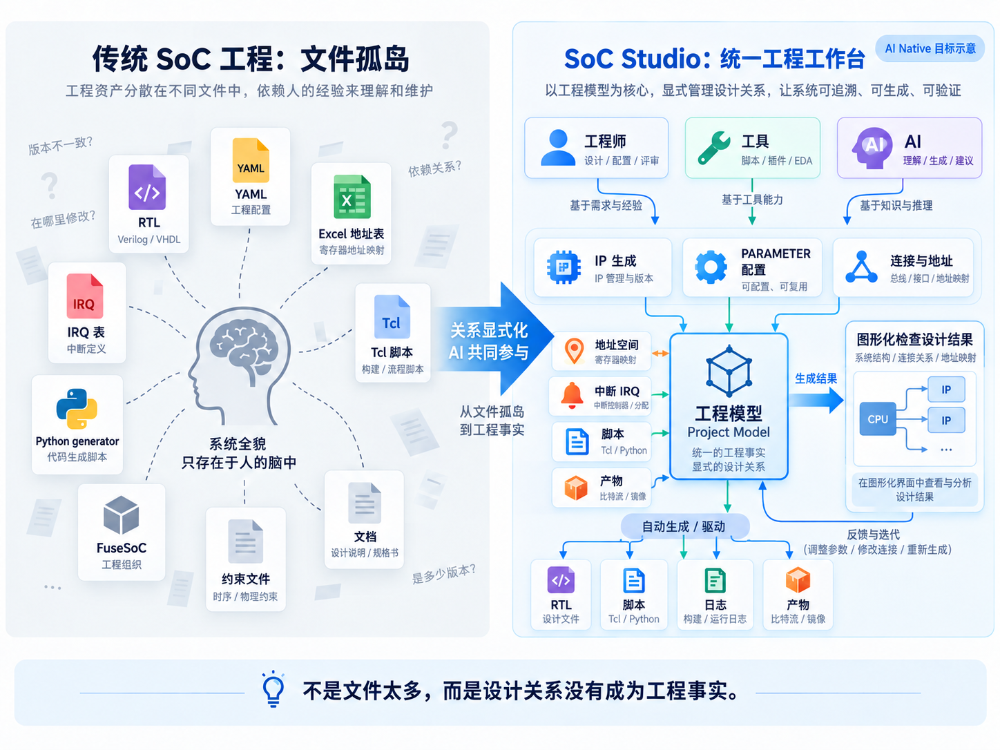

*概念图 1：左侧是分散的工程资产，右侧围绕同一工程模型组织 IP、参数、连接、地址、中断、生成与检查。人、工具和 AI 都向同一模型贡献设计动作，图形化界面用于查看结果并反馈修改。图中的验证记录和 EDA 工具属于产品方向，不代表 Aurora 已完成硬件验证。*

图中的关键变化，是把隐含在文件之间的设计关系变成共同的工程事实。工程师可以在画布上建立连接，工具可以检查端点和参数，未来的 AI 可以查询这些对象、生成或配置 IP，并解释建议会影响哪些关系。三者协作的前提是读写同一模型；图形化检查让设计结果重新回到人的视野。

这个模型至少要回答四类问题：**用的是哪一版 IP、实例如何配置、系统关系怎样连接、一次运行究竟消费了什么输入。** 保存的项目文件承载设计事实；公共 IP 包提供可复用定义；任务记录保存执行证据。画布位置和节点外观可以变，端点、参数、地址、中断及版本引用不能因此改变。

## 工作台、工程后端与已有工具怎样分工

在 AI Native 工作台里，浏览器承载设计和检查；后端保存工程模型、校验规则、调度任务并记录状态；脚本、generator 和 EDA 工具在各自的执行环境里完成具体工作。未来 AI 的设计动作也需要经过模型与工具反馈，才能成为可信的工程变更。

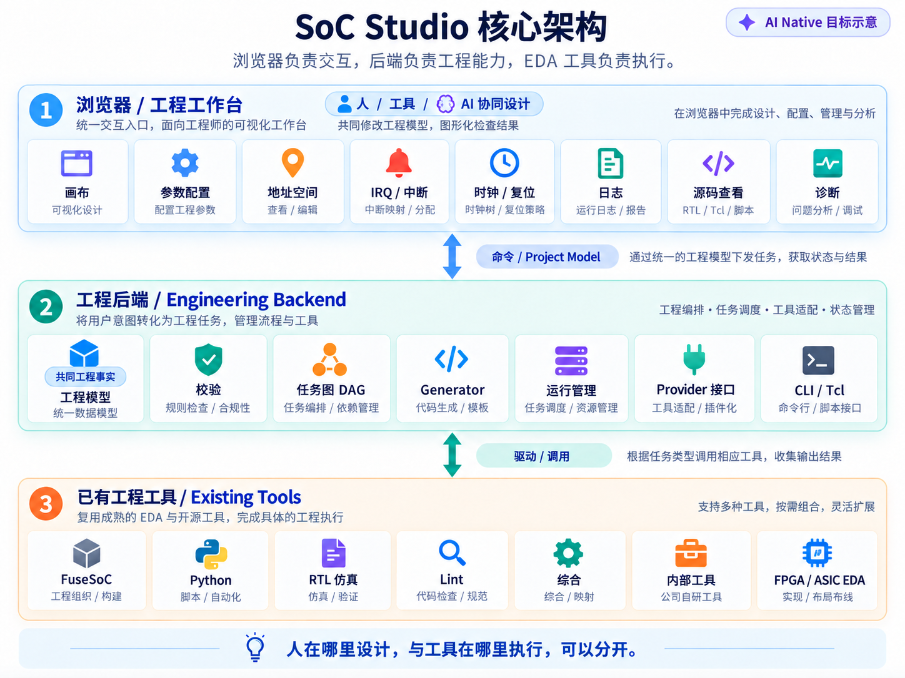

*概念图 2：上层工作台给人、工具和未来 AI 提供共同入口；中层把操作转为工程对象与任务；下层调用已有工具。AI 协作、通用 Provider、RTL 仿真、Lint、综合和实现是目标架构中的能力，不表示当前 Aurora 已执行这些环节。*

这里的边界决定了如何判断一次操作：画布和表单显示的是设计意图，工程后端负责把意图保存为可校验的数据，执行工具提供日志和产物。未来 AI 若建议“修改 uart0 的地址窗口”，它应能读出当前访问路径和已有窗口，说明修改理由，再由工程师在图形界面检查并由规则校验；这段 AI 参与流程目前尚未实现。

把“工具”放在协作者的位置也有实际含义。规则检查器已经能检查参数、端点、资源和依赖，并对兼容连线给出带假设与变更前后对照的候选；人审查后才应用到草稿。未来 AI 可以根据需求提出连接方案、解释冲突和建议修复，但不能凭相似端口名猜测时钟、复位或协议已经兼容。AI 提案与工具检查应共享对象 ID、版本和诊断，过期提案需要重新预览。

## 一份工程事实，可以从多个问题观察

总线、时钟、复位、中断和普通信号如果同时摊在一张图上，关键信息会被淹没。BUS 视图适合看访问骨架，IRQ 视图适合追中断源和控制器输入，地址视图适合核对窗口。不同视图来自同一份工程关系，不能各自维护一套互不一致的“真相”。

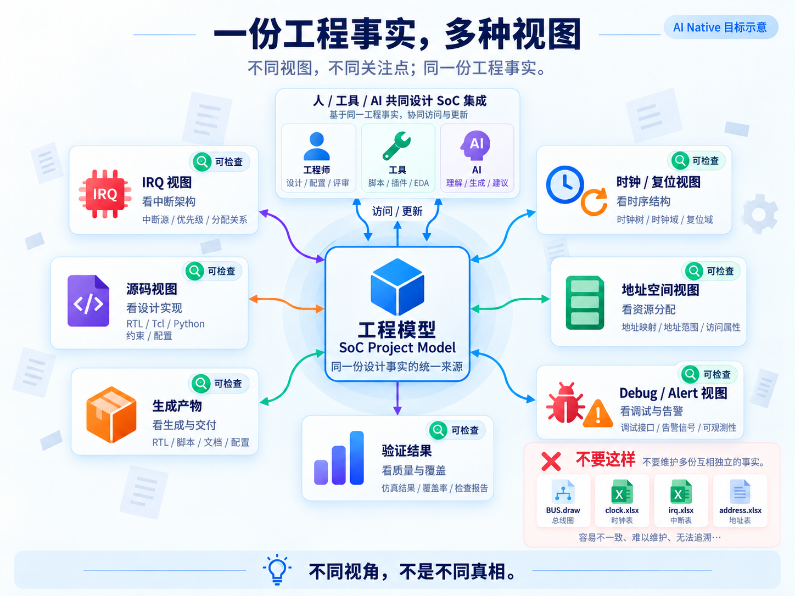

*概念图 3：工程师、工具和未来 AI 围绕同一工程模型协作；不同视图让人按问题检查设计结果。图中的源码、验证结果与 Debug 视图表达信息组织方向，不代表当前已具备完整源码交叉定位或硬件验证报告。*

图形化检查是这条设计流的终点，也是下一轮修改的起点。若 AI 调整了一个参数，工程师需要看到变化后的接口数量、连接端点和地址映射；若工具报告冲突，视图应帮助定位发生冲突的工程对象。视图按问题展示足以判断的关系，同时保留追溯到原始端点的能力。

同一设计动作还应能离开画布复现：Tcl 查询实例和端口、修改参数、建立连接、校验并保存；工程师在图上检查脚本执行后的模型。完整目标是用版本化的 Tcl 配方、锁定的 IP 包、必要源码与工具环境重建项目，并由 CI 执行同一套检查。当前 Tcl 已能复刻设计模型，支持部分工程、文件集和 Repo 会话；附件、工具运行、视图操作以及所有 SoC Studio 动作尚未全部纳入 Tcl。它也不是完整 Vivado Tcl 兼容层。

保存历史则让“怎么变成现在这样”可回答。底部时间线把已应用的设计步骤画成节点；保存时可填写说明，汇总自上次成功保存以来的操作，并下载本次增量 Tcl。每个节点可查看摘要、创建独立设计分支或预览恢复；项目还有独立 Git 历史镜像。当前 Git 镜像覆盖设计模型及事件，**不等于整个项目目录、源码附件、产物和工具运行都已纳入版本管理**。完整项目文件与执行证据的统一版本管理仍是后续目标。

## 复用 IP 的能力，而不是复制一份结果

一个标准 IP Repo 包描述版本、文件集、参数与接口约束、generator 和 regression 入口；项目实例决定这一次选用什么配置、连接到哪里；生成的 RTL、wrapper、配置和日志属于该项目。包可以是 PARAMETERIZED IP，也可以是 GENERATOR 类型，甚至同时有 RTL 参数和生成期输入。前者的参数可能进入 HDL 实例覆盖，后者的配置可能先决定脚本生成什么源码；两种语义不能混为一张无类型的参数表。

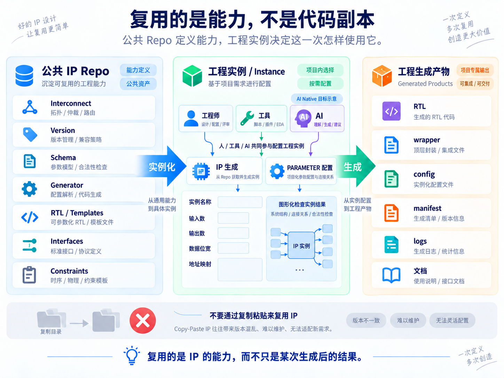

*概念图 4：公共 IP Repo 提供能力定义，人、工具和未来 AI 在项目实例上共同完成 IP 生成、PARAMETER 配置与连接，随后检查实例结果并生成项目专属产物。图中参数字段与拓扑仅用于解释关系，不是 Aurora 的具体配置。*

这也解释了为什么参数配置不能停留在一张表单里。输入数、位宽或接口形态一变，已有连线和生成入口可能随之失效。工程模型要能把这些依赖关系交给校验器，也要能把变化后的结果显示给工程师。当前 SoC Studio 已区分普通 RTL 参数化 IP 与需要先运行脚本产出源码的 generator IP。工程会锁定所用包的版本和内容摘要，项目生成结果不会反写公共 IP；未来 AI 参与时，仍须遵守相同的实例约束。

统一 Import 的含义，是把包校验、注册、实例化和配置收敛到同一工程契约。原生 Repo 可以声明参数化接口、结构化生成配置、依赖和测试任务；导入时校验文件与摘要，**不执行脚本，也不自动授予执行信任**。图形化表单按声明显示字段，后端重新求值接口；删除仍在使用的端口必须先修复连接。现有 FuseSoC CAPI2 和 IP-XACT 导入只支持明确的声明式子集，不能当作任意外部 IP 格式的无损导入。

标准包真正发挥作用是在系统上下文里。同一个 IP 定义放进不同 SoC，地址、IRQ、时钟、接口、实例参数和上游生成产物可能不同。任务读取项目快照与实例配置，在隔离的运行目录中生成这一次所需的代码；Repo 本身保持稳定。包还可以声明回归任务，由已审查、已授信的脚本在明确启用的策略下运行，结果绑定输入摘要。保存后自动回归是可选策略，不是每次保存无条件执行；Python contract regression 也不能当作 RTL 仿真。

## 从设计意图走到执行证据

生成成功只说明某项任务完成了，不能自动推导出 RTL 可编译、可仿真或芯片能够启动。要知道交付物对应什么设计，需要把输入快照、执行命令、日志、产物和后续检查串起来。设计改变后，旧产物应标记为过期，不能继续充当新设计的证据。

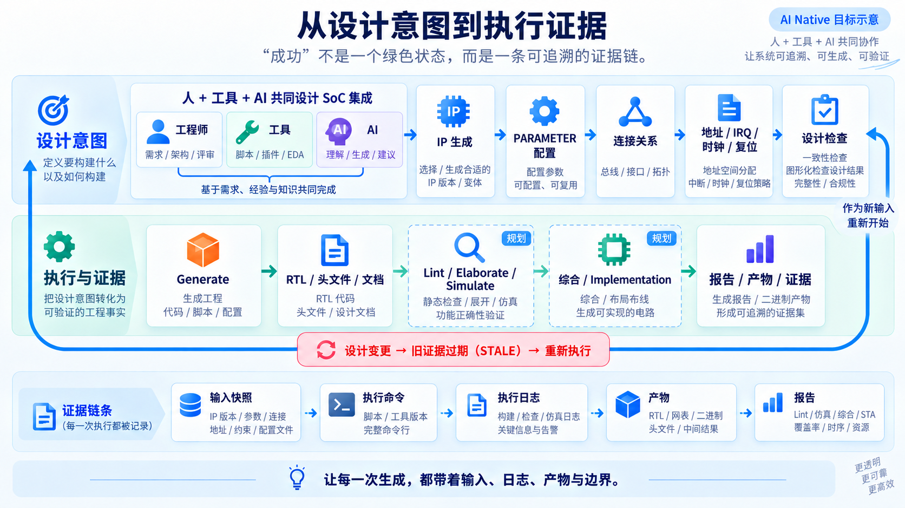

*概念图 5：人、工具和未来 AI 共同形成设计输入，图形化检查把结果带回设计环节；每次生成记录输入、命令、日志和产物。Lint、Elaborate、Simulate、综合与实现以“规划”标出，当前 Aurora 的证据止于非 EDA 源码导出。*

对 AI Native 而言，这条证据链还承担反馈作用：AI 的修改是否真正进入本次输入，工具执行到哪一步，失败指向哪个对象，产物是否仍匹配当前工程。现在这些记录主要由工程师在页面中查看；AI 尚未自动读取它们并据此继续设计。

生成链里有不同职责。IPGEN 产生参数相关的 IP RTL，REGGEN 产生寄存器文件，系统层的 TOP GEN 目标是形成结构顶层、连接和文件清单；随后才谈回归和更深的硬件验证。当前 Aurora 已实际运行部分 IP 的 ipgen/reggen 类生成器，并用工程模型生成受限的 typed 顶层与 FuseSoC 依赖源码包；通用 topgen 尚未覆盖任意 SoC，RTL 也未通过编译或仿真。每种生成器都必须声明输入、依赖、输出和失败条件，才能知道某个产物属于哪次设计。

把这些环节串成一个目标场景：工程师从标准 Repo 导入一个新外设，AI 与工具协助设置参数、提出总线和中断连接；工程师在专题视图检查端点与地址，DRC 给出可定位的诊断。保存后，时间线记录这轮设计动作及增量 Tcl；生成任务按项目上下文运行 IPGEN、REGGEN 或顶层生成，声明的回归在授权策略下执行。工程师最后在图形界面核对连接、日志和产物，并能用锁定的包与脚本重建设计。**这是完整产品设计流；当前各环节只实现了上述明确说明的切片，AI 协作尚未接入。**

## Aurora 页面里，哪些已经成为事实

概念图讲目标。下面的截图来自运行中的 SoC Studio 网页，展示 Aurora 工作工程的真实状态。当前已落地的是画布、表单、工程模型、部分校验和非 EDA 生成链路；不能把它们当成 AI 协作或硬件正确性的证明。

Aurora BUS 专题把 Ibex、两级 XBAR 和目标模块的访问骨架投影到画布上。当前视图显示 14 个实例、21 条可见连线；完整工程快照有 171 个实例、710 条连接。视图隐藏某些关系，并不意味着工程中的连接被删除。

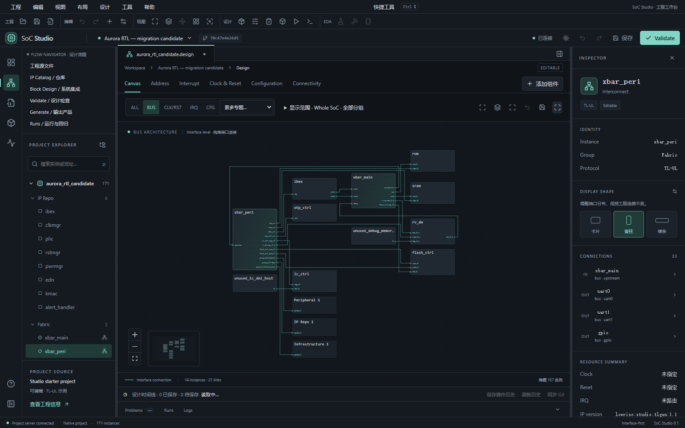

*截图 1：真实 BUS 专题。14 个实例和 21 条连线是当前可见视图的数量，不是全工程数量。*

地址页则把访问路径、目标窗口以及 Base、Size、Offset 摆在一起。截图中的 corei_uart0 映射基址为 0x40000000，窗口大小为 0x1000；当前共享译码配置会把窗口信息同步给 TLGEN 和绑定的 CPU 参数。该实现尚不支持按不同 Master 单独重映射、地址别名或权限过滤，页面里的权限字段也不能据此解释为硬件访问控制已实现。

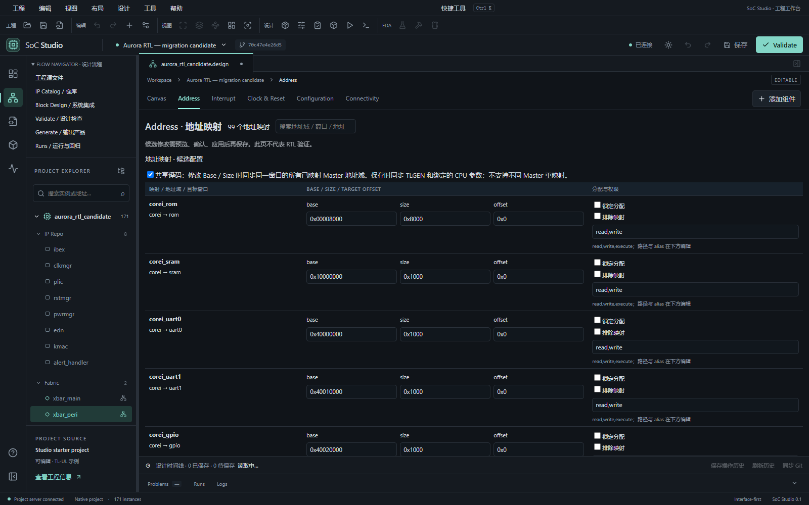

*截图 2：真实地址工作台。corei_uart0 的 Base、Size 和访问路径可直接核对；页内也写明共享译码的范围限制。*

IRQ 专题让工程师沿中断源查看具体端点。Aurora 的 32 位 GPIO 中断在工程中经 irq_split 展开，对应 PLIC 的 77～108 号输入。若只画“GPIO → PLIC”一条线，便看不到逐位编号；若永远摊开全部线，其他关系又难以阅读。专题视图可以聚合关系，再按需展开端点。

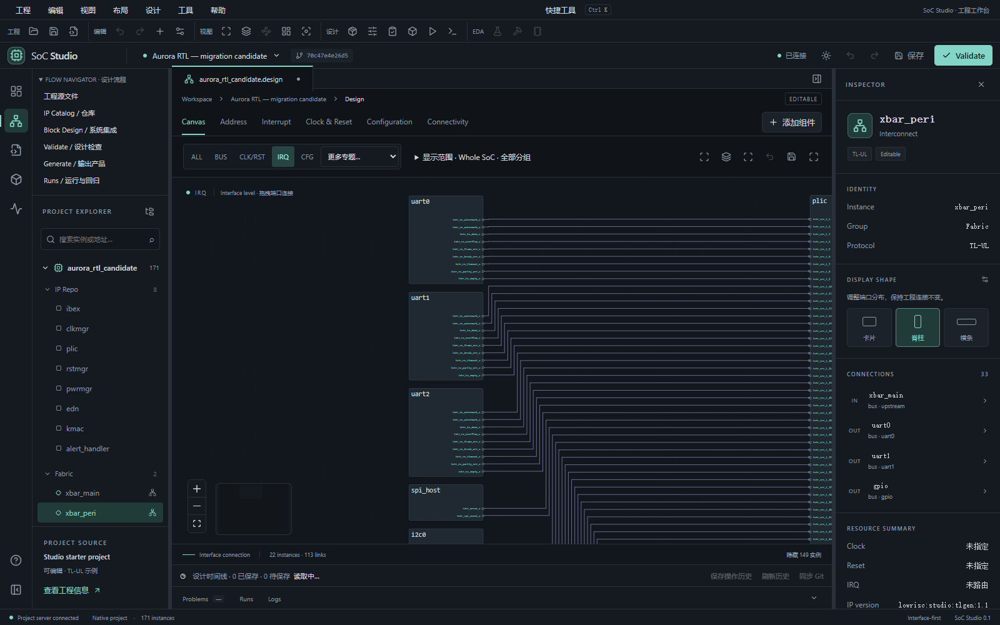

*截图 3：真实 IRQ 专题的局部画面，用于查看中断连接端点；画面没有覆盖全部可见 IRQ 连线。*

生成页面给出了另一类事实：任务、输入匹配状态、日志和产品记录。在当前 Aurora 工作工程中，已有全工程 generator 运行和系统源码包导出的自动验证记录。网页显示一个成功的系统产品，包括结构顶层 aurora_top.sv、文件清单 aurora.f、设计快照及 FuseSoC 依赖源码，共 565 个源码文件。文件数是这次产品记录的数量，不是芯片规模指标。

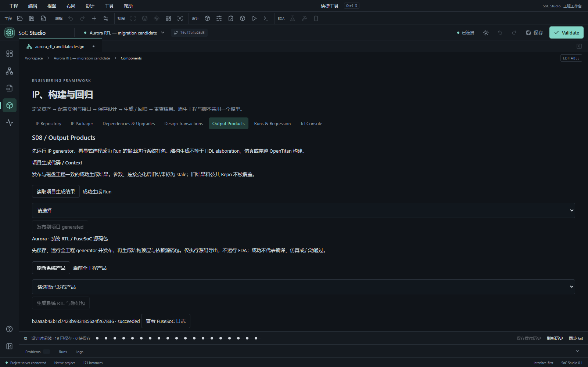

*截图 4：真实输出产品入口。页面要求先保存、运行并发布 generator 结果，同时明确限定为源码导出。*

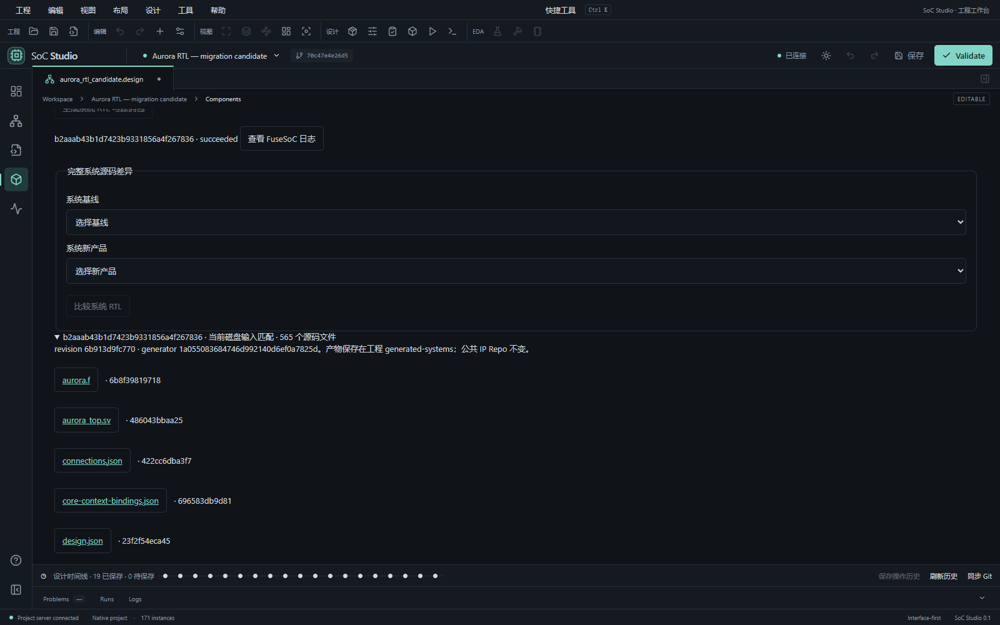

*截图 5：同一工作工程的系统产品记录，显示 succeeded、当前磁盘输入匹配、565 个源码文件和部分文件入口。该历史产物不属于新建 Demo 副本。*

这些记录说明工程数据已经驱动真实 generator，并产出了可追溯的源码包。**它们尚不证明 RTL 可编译、可仿真或可综合。**后续硬件正确性仍需要独立的编译、仿真等工具与环境。

如果想从一份可修改的工程开始阅读设计，Aurora Demo 提供了入口。它保存 171 个模块、710 条连接和 23 个锁定包。通过“新建 / 打开工程”创建副本，可得到独立的可编辑工程；副本不会继承工作工程里的生成产物，也不会因打开而运行脚本。

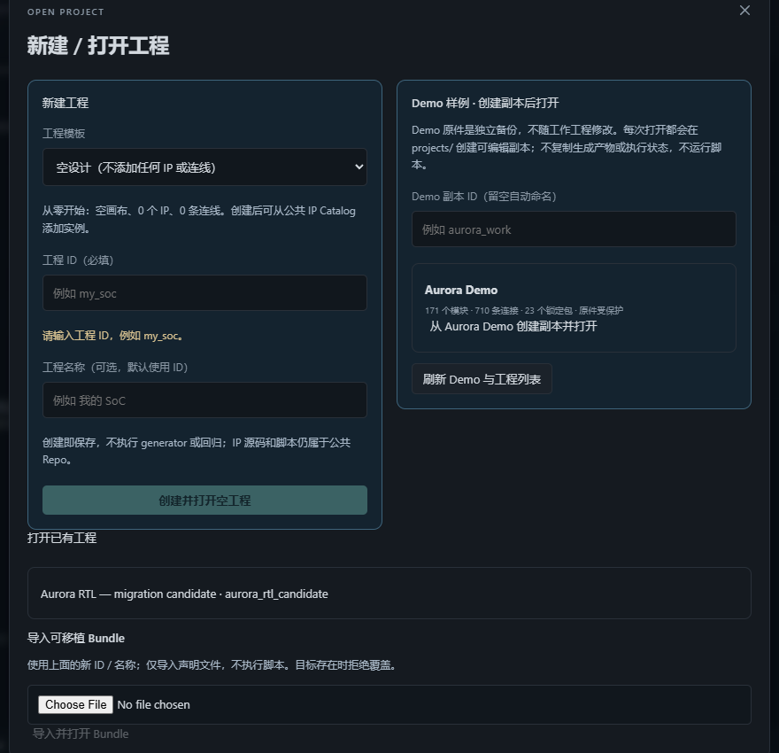

*截图 6：真实网页中的受保护 Demo 入口。右侧可创建 Aurora 副本；截图 4、5 的历史结果来自另一个已有工作工程。*

这次实践先证明了一件基础但关键的事：设计关系可以成为人和工具共同读取的工程输入，源码交付可以留下与输入对应的证据。AI Native 的下一步，是让 AI 也在这份模型上参与 IP 生成、参数配置和 SoC 集成，并把变化交给工程师在图形界面检查。当前 AI 协作尚未实现；Aurora 的硬件正确性也仍待独立验证。

