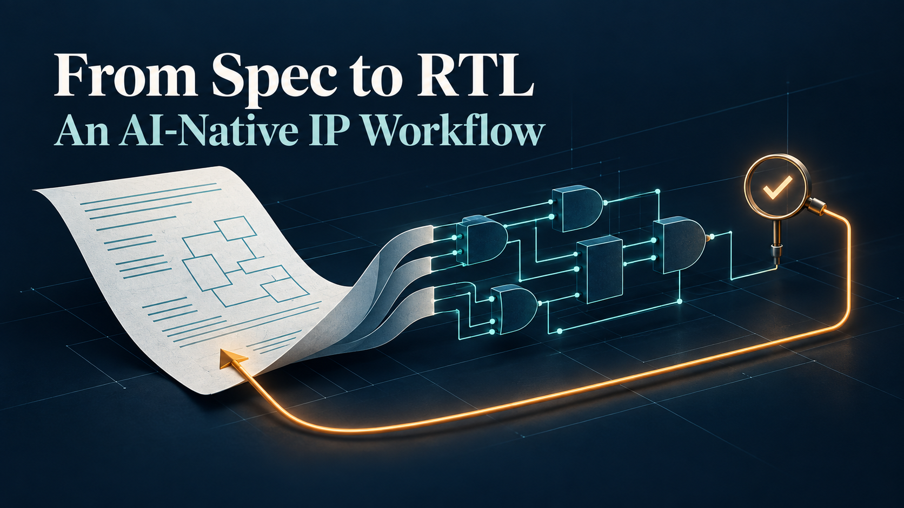
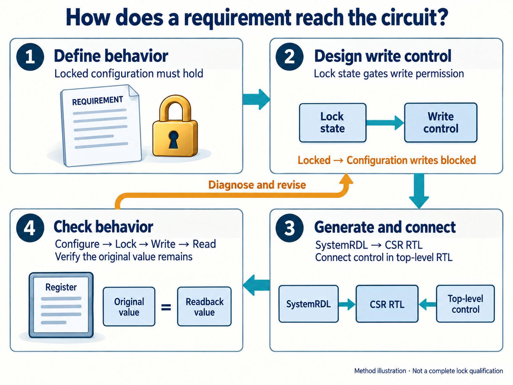
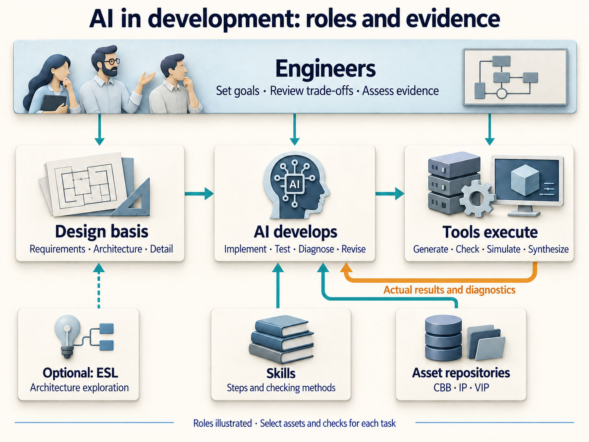
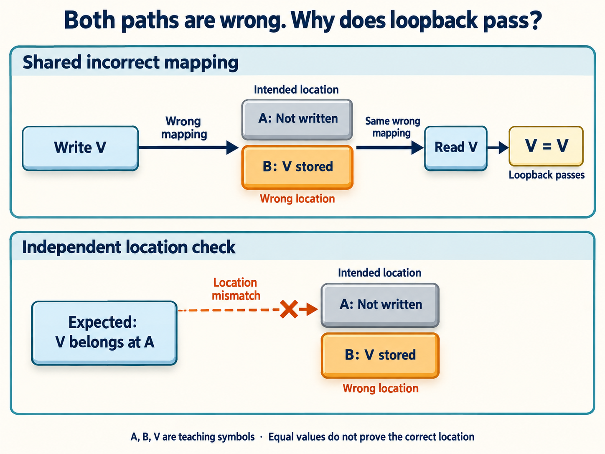

# From Spec to RTL: Building an AI-Native IP Development Workflow

[简体中文](README.md) | English

“Once the configuration is locked, software must no longer be able to change permissions.”

That sounds specific enough. Yet a design review of an AXI memory protection unit found that the register description did not inhibit configuration writes when locked. The design had a concept of locking; it also needed to connect that concept to the logic that actually permits a write.

A memory protection unit, or MPU, decides whether a request may proceed based on the requester, address range, and access attributes. AXI is the on-chip bus interface used in this design. Software configures permissions and then locks the configuration. Fixing the omission involved adding write-enable control to the register description, driving that control from the top-level RTL, regenerating the register logic, and running a directed test that attempts to write after locking.

This small problem captures the development approach I am exploring. AI participates from the specification onward, through architecture, RTL, and verification. RTL—register-transfer level—is a description of hardware state and data movement. At each step, an idea from the previous layer has to become an engineering object that the next layer can both use and check.

I call this an **AI-native IP development workflow**: AI stays involved in the engineering work, while design intent, implementations, check results, and lessons from corrections remain available for subsequent tasks. Here, “AI-native” describes my own practice. The AXI MPU and AXI4 verification component examples below show how it works. The rules continue to evolve, and earlier project records retain their own scope.

## Make the specification concrete enough to discuss and check

“Implement a configuration lock” leaves AI with many choices. Which fields does the lock protect? Are reads still allowed? Can software unlock it? What happens after reset? Should fault status and interrupt clearing remain accessible?

The answers change hardware behavior. When the specification leaves them open, a coding choice can quietly become a design decision, while software and verification may assume something else.

The IP development method I use separates design information into related layers. First establish externally observable behavior, then choose an architecture, and finally define fields, signals, and timing. The verification plan establishes how to tell whether the requirements have been met. Configuration write protection illustrates the division:

| Design document | Question it answers | What the lock needs to define |
| --- | --- | --- |
| LRS: low-level requirements specification | What behavior is required? | Which settings must hold after locking, and when they may change again |
| HLD: high-level design | Which architecture, and why? | The configuration access path and protection mechanism |
| LLD: low-level design | How do fields and signals work? | Lock state, write enables, updates, and reset behavior |
| VPLAN: verification plan | Which observations establish correctness? | Configuration before locking, attempted writes afterward, and expected readback |

This table is a teaching summary of the method. Each document still needs to define the behavior of its objects; the document names do not do that work.

At the requirements stage, “permission settings remain unchanged after locking” does not require a gate-level drawing. Detailed design does need to identify the inhibited write path, how the lock itself changes, and which state remains unaffected. With those responsibilities separated, AI can add detail in the appropriate place, and engineers can review the choices more easily.

The same issue appears in simple peripherals. In a GPIO, what happens when software clears interrupt status on the very cycle that a new event arrives? “Supports interrupts” does not answer that. Defining the priority between the event and the clear before writing RTL and tests gives both a common basis.

AI is useful for expanding these boundaries: identifying questions about normal operation, errors, reset, and concurrency; finding inconsistent descriptions; and carrying agreed answers into the design. Engineers determine which questions matter to the product and whether the choices meet system needs. Recording unresolved behavior as an open decision makes it easier to manage than allowing generated code to decide implicitly.

## Keep design intent in a known place, and start changes there

As the design becomes more detailed, it acquires several representations: prose, structured models, register descriptions, RTL, software headers, and tests. Each describes some aspect of the same IP for a different purpose.

The current IP Skill follows this rule: **Markdown documents hold design intent, tools extract machine-readable models, and SystemRDL defines register structure.**

The prose explains behavior and rationale. Structured metadata in the documents records requirement identifiers, objects, and relationships. Extractors turn that information into YAML or JSON for downstream checks and generation. When a requirement changes, the design source is edited and the models are extracted again. Editing a derived model directly would risk leaving the documents with a different story.

Registers have a further division of responsibility. Detailed design describes field behavior, including locking, clearing, and the relationship between hardware updates and software writes. SystemRDL defines structural information such as addresses, widths, access properties, and reset values. Generation tools use it to produce control and status register (CSR) RTL and other views, including software headers. Special hardware behavior still has to be connected correctly and checked in execution.

In the AXI MPU example, the missing piece was how the lock inhibited configuration writes. The corrected SystemRDL uses write-enable properties to connect the relevant fields to a control signal. Top-level RTL drives that signal from lock state. Separately, the global lock field is defined so that writing one sets it and writing zero leaves it unchanged.

*Figure 1 | AI-generated method illustration. Lock state must control write permission, and the check must observe whether protected settings retain their values. This is not a claim of complete lock qualification.*

The existing directed test configures a region, sets its region lock, attempts to change its base address and permissions, and reads them back against the original values. Later steps also check that writing zero does not clear the global lock field and that reset clears it. The engineering record documents the correction and regression results.

The scope matters: this implementation uses a shared write enable, so setting any region lock freezes configuration writes to all regions. The example shows how write protection was implemented; it does not establish independently qualified locking for each region.

This division gives a change a clear path. Behavioral decisions belong in design documents, field structure in SystemRDL, connections in RTL, and expectations in checks. Extraction and generation help maintain structural consistency, while design semantics still require review. Extracting a requirement into YAML does not mean arbitrary requirements can be deterministically compiled into correct circuitry.

## What Skills and asset repositories contribute

To continue into the next stage, AI needs the current design, available assets, expected steps, and criteria for judging the result. When that context lives only in a long conversation, later changes become harder to ground accurately.

In this workflow, a Skill carries the engineering method: required inputs, expected outputs, conditions that need further checking, and where to investigate when a tool fails. Before generating RTL, for example, AI needs the detailed state machines, interfaces, reset behavior, and parameter constraints. For parameterized IP, it also needs to know which configurations are legal and which combinations warrant particular attention.

A Skill can help prevent omitted steps. A rule saying “complete verification” does not establish that verification happened. Results still come from execution and review.

Asset repositories hold engineering objects that can be reused. CBBs are common building blocks such as FIFOs, arbiters, and synchronization logic. An IP owns a complete function and its interface responsibilities. A VIP, or verification IP, generates transactions, observes a bus, and checks protocol behavior. Each has a different reuse boundary.

Connecting a VIP to an IP lets a project reuse protocol transactions; product-specific rules still need their own checks. For an MPU, whether a requester has permission is a product decision. Legal bus handshakes do not answer it. Likewise, choosing a CBB requires checking its width, reset behavior, latency, and supported configurations. A matching module name is not enough.

*Figure 2 | AI-generated illustration of responsibilities. Arrows show information flow, not proof that a single orchestrator already connects every repository. ESL is an optional architecture exploration branch.*

Tools perform specific jobs along the way: extracting design information, generating register views, compiling, simulating, and synthesizing. These checks answer different questions. Static checks can find certain coding or structural problems. Simulation checks the scenarios actually applied. Synthesis helps assess mapped area and timing. AI reads the feedback, investigates causes, and proposes and implements changes; engineers judge whether the goals and trade-offs still hold.

Designs that require comparisons of bandwidth, buffering, or resource organization can use electronic system-level (ESL) models before RTL. Those models inform architectural choices. Their statistics must be interpreted within the modeling assumptions, rather than treated as measured chip performance. A simple IP does not need an ESL stage merely to fill out a process diagram.

Parameterized design also needs limits on complexity. Ordinary parameterized RTL can use SystemVerilog parameters and generate constructs. When configuration changes instance counts and connectivity, the current method allows Python-based hardware intermediate representations or graphs to assemble the structure. Behavioral modules remain in SystemVerilog and are verified separately.

Three states must remain distinct: a configuration is legal, code generation succeeded, and that configuration passed actual verification. A parameter matrix records what the project plans to check. Execution results establish what has been checked.

## When implementation and tests share a mistake

Having AI work on both RTL and verification lets it follow a requirement across the project. It also creates a concrete risk: the same mistaken interpretation may appear in several places.

AXI4 VIP development provided an instructive example. Both read and write paths in the memory model calculated byte-address mappings incorrectly. A write put data in the wrong location, and a read used the same wrong mapping to retrieve it. Writing and reading back still returned the original data.

For that loopback check, the two mistakes cooperated. Equal data did not establish that it had reached the location required by the protocol.

The project then established basic semantic tests with explicit inputs and predetermined expected results for addresses, byte lanes, memory access, and transactions. Those tests exposed the defect. The same round of work also found mistakes in test expectations and test cases. A failure therefore requires examining both the implementation and the basis for the verdict.

*Figure 3 | AI-generated illustration of a shared-error mechanism. A, B, and V are teaching symbols for the intended location, wrong location, and data. They do not reproduce the defect's actual addresses or bus timing.*

**An independent expectation needs a source that can be reviewed.** It may come from the protocol definition, manually checked vectors, or a different derivation that has itself been examined. Copying the implementation formula into a file called “reference model” only moves it. Switching models or starting another conversation does not, by itself, establish independence either.

The checker also needs to be challenged. To check whether data remains stable while a transfer waits, first create an actual waiting interval, then change the data during that interval and observe whether the expected violation is reported. Injection code that never creates the violation at the target interface does not demonstrate detection.

The VIP records show complementary layers emerging from this work. Basic tests check local semantics. System self-tests check that components work together. Violation injection checks detection of specified errors. Legal controls check for false alarms. Each contributes a different piece of evidence.

The same reasoning applies when reading a configuration-lock test. Reading a one from a lock bit establishes the state of that bit; the test also needs to attempt a write to a protected field and check the outcome. To verify two protection paths separately, each needs suitable initial conditions, so an already active path does not conceal whether the other works. A test name or a PASS result cannot replace understanding those conditions.

## Leave the correction for the next task

Resolving a problem can leave three useful things behind: a corrected implementation, a test that can detect the problem again, and a method that applies to other projects.

During AXI4 VIP development, the basic semantic testing mechanism entered the project, verification templates, and Skill in the same round of work. Lessons about requirement classification and runtime transaction models were also written back into the method. A subsequent task can read those rules and start with a more explicit basis.

Engineering judgment is still needed. Some fixes belong in a shared component, such as making configuration objects usable even when they have not been randomized. Some belong in a checking method, such as verifying address mapping separately from data content. Others are choices for a particular product and should not become mandatory rules for every IP.

Version correspondence is another useful result to retain. Which source, configuration, tool version, and execution produced a regression result? Those details determine what conclusions it can still support. A file hash helps identify changed inputs; it does not prove the design correct. The current IP method conservatively invalidates design evidence when its source changes, so affected evidence must be obtained again instead of inheriting an old pass status.

This also gives AI concrete follow-up work. It can use a specific failure to revise the implementation, add checks, and inspect new results. If synthesis shows that a timing target has not been met, the next step is to revisit structure and constraints; increasing the target frequency written in a report does not improve the circuit. Comparisons of power, performance, and area—PPA—need explicit configurations, libraries, and constraints, and synthesis estimates must remain distinguishable from silicon measurements.

Delivery also needs information for the integrator: configuration, interfaces, dependencies, and usage boundaries. System integration work such as SoC Studio consumes that information to place IP in a larger design. Source generation and connection checks provide useful results, while subsequent hardware verification has its own work to do.

## Where I want the next IP to begin

Returning to the lock example, the work includes explaining the requirement, choosing a mechanism, completing the connections, designing effective checks, and carrying corrections back into the appropriate design source. AI can participate in many of those steps, while tool feedback helps engineers decide what to do next.

This workflow has already left concrete engineering results: an omitted configuration write control was corrected, semantic tests found an address-mapping defect that VIP loopback checks had missed, and tests and design lessons entered reusable methods and assets. Those results have defined scopes and provide a basis for further improvement.

I want the next IP to begin with a clearer requirements framework, suitable reusable building blocks, and checks that retain lessons from previous problems. The next question is how those lessons hold up with another kind of IP, another set of parameters, and another integration environment—and where fresh design is required.

That is the part of putting AI into the development process I want to keep investing in: completing one piece of work should also improve the starting point for the next.
