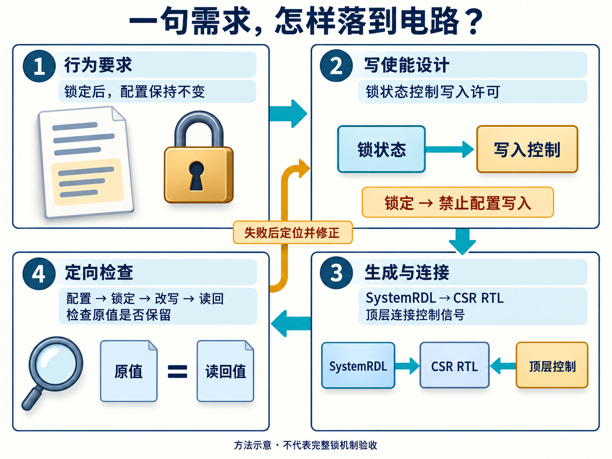
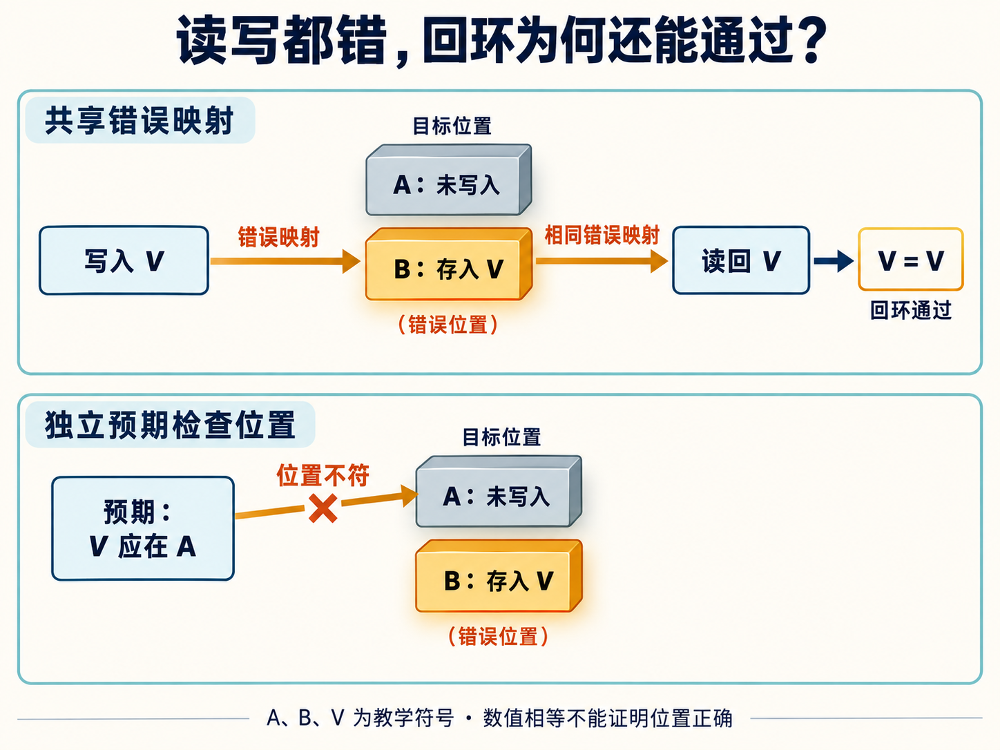

# 从 Spec 到 RTL：我正在尝试一种 AI-Native IP 研发流程

简体中文 | [English](README.en.md)

“配置锁定后，软件不能再修改权限。”

这句话看起来已经足够明确。可在一次 AXI MPU 设计评审中，寄存器描述仍漏掉了对配置写入的抑制。工程里有锁的概念，还需要把它接到真正控制写入的位置。

MPU 是内存保护单元，根据访问者、地址范围和访问属性决定请求能否通过；AXI 是这里使用的片内总线接口。软件先配置权限，再锁住配置，是这个 IP 的一项要求。修正时，寄存器描述补上写使能控制，顶层 RTL 提供控制信号，重新生成寄存器电路，再用“锁定后尝试改写”的定向测试检查结果。

这个小问题很适合解释我正在尝试的研发方式。AI 从 Spec，也就是规格与需求，开始参与，逐步推进到架构、RTL 和验证。RTL 是寄存器传输级电路描述，用代码表达硬件的状态与数据变化。沿途每一步，都需要把上一层的意思变成下一层可以使用、也可以检查的工程对象。

我把这种工作方式称为 **AI-Native IP 研发流程**：让 AI 持续参与工程工作，把设计意图、实现、检查结果和修正经验保留下来，使后续任务能够接着做。这里的 AI-Native 是我对自身实践的描述；下面结合 AXI MPU 和 AXI4 验证组件的开发记录，说明这套方法如何工作。当前整理出的规则也在演进，早期项目的执行记录各有自己的范围。

## 先把 Spec 写到可以讨论、可以检查

一句“实现配置锁”，给 AI 留下了很多选择：锁保护哪些字段？锁定以后，读访问是否继续？软件能不能解锁？复位后恢复什么？故障状态和中断清除是否也被禁止？

这些问题会改变硬件行为。若需求没有回答，代码里的某种写法就可能悄悄成为设计决定，而软件和验证环境未必采用相同理解。

我正在使用的 IP 开发方法，把设计材料分成几个相互承接的层次。先定义外部应观察到什么，再讨论采用什么结构，最后落实字段、信号与时序；验证计划则明确怎样判断要求得到满足。以配置写保护为例，可以这样理解它们的分工：

| 设计材料 | 要回答的问题 | 配置锁需要明确什么 |
| --- | --- | --- |
| LRS：低层需求规格 | 应具备什么行为？ | 锁定后哪些配置不能改变，何时恢复 |
| HLD：高层设计 | 用什么架构实现，为什么？ | 配置访问路径与保护机制 |
| LLD：详细设计 | 字段和信号具体怎样工作？ | 锁状态、写使能、更新与复位关系 |
| VPLAN：验证计划 | 用什么观察判断对错？ | 锁前配置、锁后改写及读回预期 |

这张表是对方法的教学整理。实际设计仍要补全对应对象的行为，不能靠四份文档的名字代替思考。

例如，需求阶段说清“权限配置锁定后保持不变”，并不要求此时就画出每个逻辑门。到了详细设计，则必须知道哪条写入路径会被阻断，锁本身如何更新，哪些状态不受它影响。层次分清以后，AI 才能在合适的位置补内容，人也更容易审视其中的取舍。

类似的问题在简单外设里同样存在。GPIO 中，软件清除中断状态的同一拍又来了新事件，应该留下哪个结果？“支持中断”没有回答这个问题。先明确事件与清除的优先关系，再写 RTL 和测试，双方才有共同依据。

AI 很适合帮助展开这些边界：列出正常、异常、复位和并发情况下需要回答的问题，找出前后描述不一致的位置，再将确定的答案落实到设计中。工程师要判断哪些问题与产品有关，以及选择是否满足系统需要。对于尚未决定的行为，把它显式留作待决项，比让生成代码替我们作决定更容易管理。

## 设计意图留在哪里，修改就从哪里开始

设计细化以后，会出现多种表示：自然语言、结构化模型、寄存器描述、RTL、软件头文件和测试。它们都在描述同一个 IP，却各有用途。

当前 IP Skill 的约定是：**Markdown 文档保存设计意图，工具从中抽取机器可读的模型；寄存器结构由 SystemRDL 定义。**

Markdown 正文解释行为和理由，文档中的结构化标记记录需求标识、对象及关联关系。抽取工具把这些信息转换成 YAML 或 JSON，供后续检查和生成步骤使用。需求变化时，先修改设计源，再重新抽取，避免直接改派生模型以后，文档仍保留旧说法。

寄存器又有自己的分工。详细设计解释字段怎样工作，例如锁定、清除、硬件更新与软件写入的关系；SystemRDL 描述地址、位宽、访问属性、复位值等结构信息。生成工具据此产生 CSR，也就是控制与状态寄存器的 RTL，以及软件头文件等视图。特殊硬件行为仍要正确连接，并在运行中检查。

回到 AXI MPU。早期遗漏的是“锁如何抑制配置写入”。修正后的 SystemRDL 使用写使能属性，把相关配置字段接到控制信号；顶层 RTL 根据锁状态驱动这个信号。全局锁字段另外采用写 1 置位、写 0 不改变的定义。

*图 1｜AI 生成的方法示意。重点是锁状态必须作用于写入许可，检查还要观察被保护配置是否保持。图中不表示完整锁机制已经验收。*

已有定向用例先配置一个区域，置位区域锁，再尝试改变基地址与权限，读回核对原值；后续步骤还检查全局锁字段写 0 不清除、复位后清除。工程记录保存了这一轮修正与回归结果。

这个案例的范围也要说准：当前实现使用共享写使能，任一区域锁置位都会冻结全部区域配置写入；这里展示的是写保护如何落地，不能据此推出逐区域独立锁定已经验证。

这套分工让修改有了路径：行为约定进入设计文档，字段结构进入 SystemRDL，连接进入 RTL，预期进入检查。抽取和生成工具能帮助维持结构一致性，设计语义仍需要审查。尤其要避免产生一个误解：把需求抽成 YAML，并不意味着任意需求都能由工具确定性地编译成正确电路。

## Skills 和资产仓，给连续研发提供什么？

当 AI 要接着完成下一阶段时，它需要知道当前设计、可用资产、应执行的步骤，以及怎样判断结果。这些上下文如果只留在一长段聊天里，后续修改就很难准确找到依据。

在这套实践中，Skill 承担工程方法的载体：任务需要哪些输入，应产出什么，哪些情况必须进一步检查，工具失败后应该回到哪里定位。比如生成 RTL 之前，要读清详细设计中的状态机、接口、复位和参数约束；处理参数化 IP 时，还要知道哪些配置是合法的，哪些组合需要重点验证。

它可以帮助 AI 少漏步骤，但 Skill 里写着“完成验证”，不代表验证已经发生。具体结果仍来自实际执行和评审。

资产仓则保存能够继续使用的工程对象。CBB 是公共基础逻辑构件，例如 FIFO、仲裁器和同步逻辑；IP 承担完整的功能与接口责任；VIP 是可复用的验证组件，负责产生事务、观察总线并检查协议行为。它们的复用边界不同。

给一款 IP 接入 VIP 后，协议事务可以复用，产品自己的规则仍需检查。对 MPU 来说，“这笔访问是否有权限”属于产品行为；总线握手合法，并不自动回答这个问题。选择 CBB 时也要核对位宽、复位、延迟和支持配置，不能仅凭模块名称认为它适合当前设计。

*图 2｜AI 生成的协作关系示意。箭头表示职责与信息流，不表示所有资产仓已由一个编排器自动贯通；ESL 是按需采用的架构探索分支。*

工具在中间承担明确的工作：抽取设计信息，生成寄存器视图，编译、仿真和综合。不同检查回答不同问题。静态检查可以发现一类编码或结构问题；仿真检查实际施加的场景；综合帮助判断 RTL 映射后的面积和时序。AI 阅读反馈、定位原因、提出并实施修改，人则判断设计目标与取舍是否仍然成立。

对于需要比较带宽、缓冲或资源组织的设计，还可以先使用 ESL，即电子系统级模型，进行架构探索。它为结构选择提供信息；模型里的统计结果仍要按建模假设理解，不能直接当作实际芯片性能。简单 IP 没有必要为了流程完整而强行增加这一层。

参数化设计也需要控制复杂度。普通参数化 RTL 可以用 SystemVerilog 参数与生成结构；当配置会改变实例数量和连接拓扑时，当前方法允许用 Python 的硬件中间表示或图来拼装结构，行为模块继续用 SystemVerilog 表达，并分别验证。

这里要一直区分三个状态：配置合法、代码生成成功、该配置实际验证通过。工程里列出了一张参数矩阵，只能说明计划检查哪些组合；执行结果才能说明已经检查了什么。

## 实现和测试一起写错，怎样发现？

让 AI 同时参与 RTL 和验证，能使它围绕同一条需求持续工作，也会带来一个具体风险：它可能在不同位置重复使用同一个错误理解。

AXI4 VIP 开发中出现过一个很有说明力的例子。存储模型的读写路径都把字节地址映射算错了。写入放错位置，读取又按同样的错误映射取数，写后读回仍能得到原数据。

对这种回环检查而言，两个错误恰好相互配合。比较值相等，没有证明数据进入了协议要求的位置。

后来建立的基础语义测试，用明确输入和预先确定的期望值分别检查地址、字节位置、存储访问与事务行为，暴露了这个问题。同一轮工作也发现了测试期望和用例自身的错误。因此，测试失败以后，需要同时审视实现和判断依据。

*图 3｜AI 生成的同源错误原理示意。A、B、V 是教学符号，用来区分目标位置、错误位置和数据，不代表原缺陷的具体地址或总线时序。*

**独立预期需要有可审查的来源。** 它可以来自协议定义、人工核对的测试向量，或者另一种经过检查的推导。把实现里的公式复制到一个名为“参考模型”的文件中，只是换了位置；更换一次模型或新开一段对话，也不能自动证明推导独立。

检查器本身还需要受到挑战。例如，要检查等待期间的数据是否稳定，就应先制造真实的等待窗口，再让数据在窗口内发生变化，同时观察检查器是否报告预期违规。写了注入代码，却没有在目标接口上形成违规，不能说明检查器已经抓住错误。

在现有 VIP 记录里，这些工作逐渐形成了互补层次：基础测试检查局部语义，系统自测试检查组件配合，违规注入检查能否发现指定错误，合法对照检查是否误报。每层都提供一部分证据。

同样的思路可以用来阅读配置锁测试。锁位读回为 1，只说明锁位处于那个状态；还应对受保护字段发起改写，再检查结果。若要分别验证两条保护路径，应分别构造前置状态，避免其中一条已经生效，遮住另一条是否工作。测试的名字或一个 PASS，不能代替对这些条件的理解。

## 把修正留给下一次工作

一次问题解决以后，工程还可以留下三类东西：修正后的实现、能再次抓住该问题的测试，以及适合其他项目使用的方法。

AXI4 VIP 的开发记录里，基础语义测试机制在同一轮工作中进入了项目工程、验证模板和 Skill。需求分类、运行时事务模型等经验也被写回方法说明。下一次任务读取这些规则时，就有机会从一个更明确的起点开始。

这里仍然需要工程判断。有些修正应进入公共组件，例如配置对象在未随机化时也应具有可用的默认值；有些适合进入检查方法，例如分别验证地址映射和数据内容；另一些只是当前产品的取舍，不宜变成所有 IP 的强制规则。

版本对应关系同样值得留下。一次回归结果属于哪份源码、哪个配置、哪版工具和哪一轮执行？这些信息决定结果还能支持什么结论。文件哈希可以帮助确认输入是否变化，却不能证明设计本身正确。当前 IP 方法采用保守的设计源变更失效规则，源内容改变以后，需要重新取得相应证据，不能直接沿用旧的通过状态。

这也让 AI 后续的工作更具体。它可以根据明确的失败位置修改实现，补充检查，再读取新的运行结果；如果综合表明时序目标没有达到，就要回到结构与约束讨论，而不能只把报告里的目标频率改得更高。需要比较 PPA——功耗、性能与面积——时，比较双方的配置、库和约束必须清楚，综合估计也应保留其与硅片实测的区别。

最终交付还需要为集成者准备配置、接口、依赖和使用边界。SoC Studio 这类系统集成工作会继续消费这些信息，将 IP 放进更大的设计；源码生成和连接检查有各自的价值，后续硬件验证仍有自己的任务。

## 我希望下一款 IP 从哪里开始

回到开头的配置锁，完整的工作包括解释要求、选择机制、补齐连接、设计有效检查，并在出错后把修改带回相应的设计源。AI 可以参与其中许多环节，工具反馈则帮助工程师判断下一步该做什么。

这套流程已经留下了具体的工程成果：配置写保护遗漏得到修正，VIP 中回环检查未能暴露的地址映射问题被找到，基础测试与设计经验进入后续可以读取的方法和资产。它们各有检查范围，也提供了继续改进的依据。

我希望下一款 IP 开始时，手边已有一份更清楚的需求框架、一组适合复用的构件，以及能提醒我们旧问题的检查。接下来要继续验证的是：这些经验换到另一类 IP、另一组参数和另一个集成环境后，哪些仍然有效，哪些需要重新设计。

对我而言，这正是把 AI 放进研发流程后值得持续投入的部分：每完成一次工作，下一次工作的起点也能随之改善。
