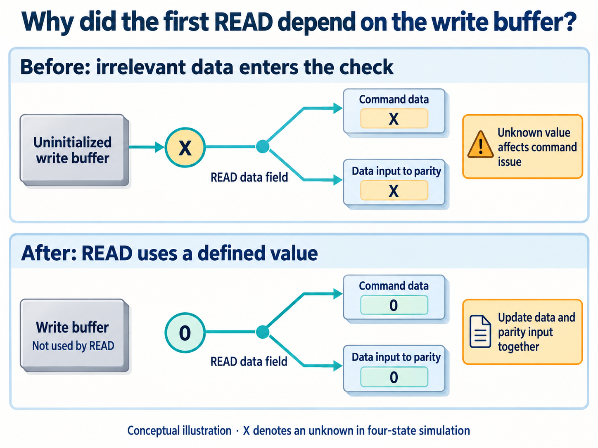
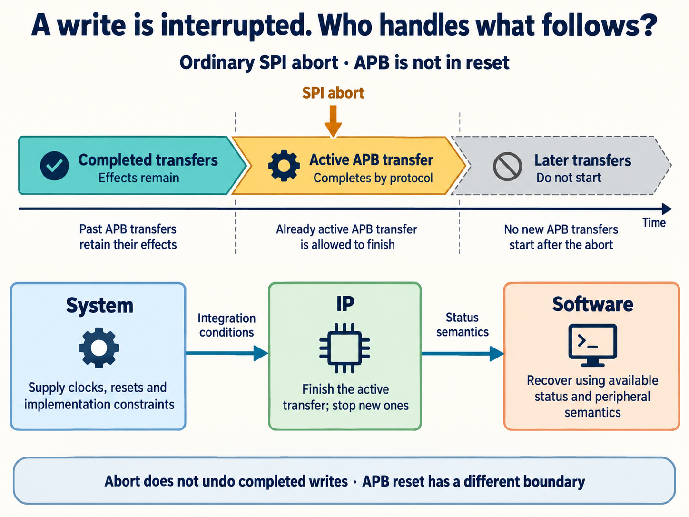
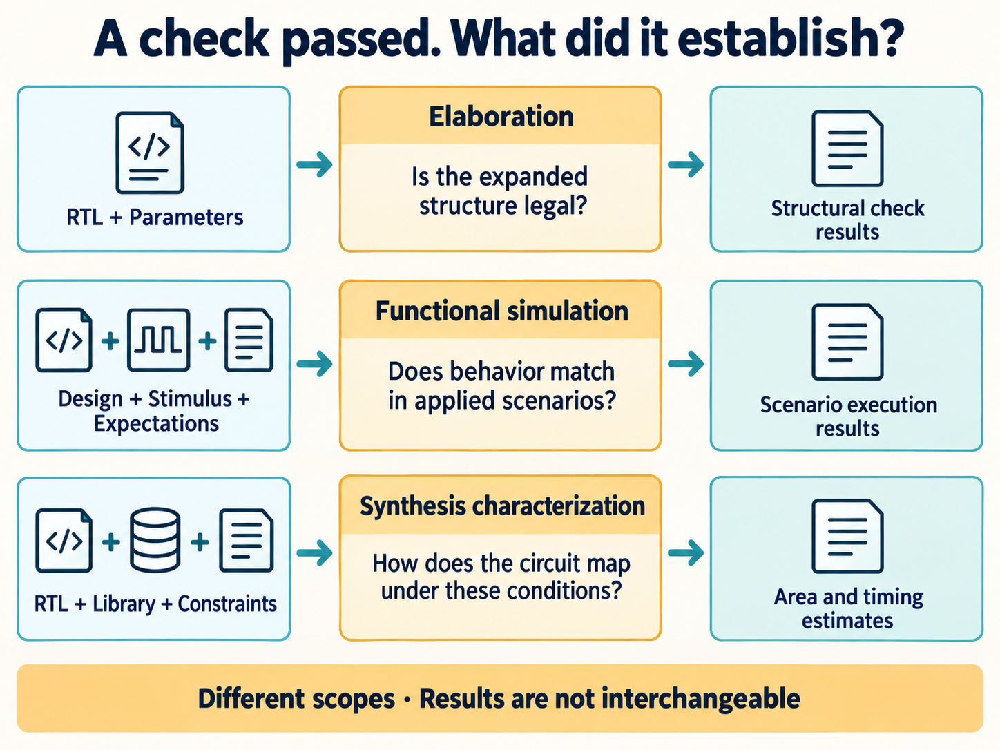

# Why Is Generating RTL with AI Easier Than Delivering a Reusable IP?

[简体中文](README.md) | English

A natural way to try AI-assisted chip development is to ask it to implement a counter, a register bank, or some interface control logic. With RTL—code describing hardware state and data movement—and a test environment, engineers can start checking the basic behavior.

Once normal reads and writes work, can that implementation become an IP block for another project to reuse?

The recipient may use it in a different order. They might read immediately after power-on, reset during a transfer, or select an uncommon parameter combination. Whether these **corner cases still meet the design contract** directly affects whether the block can be integrated with confidence.

The relative ease in the title concerns obtaining a candidate implementation; complex RTL design remains demanding. Delivery adds the work of turning each critical boundary into an explicit behavior rule and retaining results from checks that actually ran.

A real first-read defect in an SPI2APB bridge lets us follow four steps: **find the boundary → define the behavior → check it → state the assurance scope.** Corrected scenarios also need to remain in regression so later changes can check them again.

## Step 1: Find the assumptions hidden in normal usage

SPI2APB lets an external controller use an SPI serial interface to access registers on an on-chip APB peripheral bus. A natural test sequence is to write a value, read it back, and compare.

That checks the read/write path. It also introduces a condition: the write path has already run before the first read.

The bridge's development record describes a failure on the first READ after power-on, exposed after parity checking was added to internal commands. READ needed no write payload, yet command preparation still fetched data from the write buffer.

The wide buffer was not reset in its entirety. Unwritten locations could contain `X`, an unknown value in four-state simulation. Parity calculates check information from protected fields, so this otherwise irrelevant data entered the checking path.

Reading immediately after power-on exposed the dependency on uninitialized storage. Writing before reading could conceal it. Both tests exercise a read, but under different conditions.

One way to find corner cases is therefore to remove assumptions embedded in normal tests. Replacing “write, then read” with “read immediately after power-on” creates a new scenario with a specific purpose.

The same reasoning extends to timing and parameter boundaries:

| Where to look | Condition to question | Candidate scenario |
| --- | --- | --- |
| Initialization | Does an operation depend on an earlier action? | READ immediately after power-on |
| State transitions | What if two events occur close together? | Abort while a transfer awaits completion |
| Parameter extremes | Does the minimum configuration change the structure? | Maximum transfer length set to 1 |

This table generates candidate scenarios; execution results still need to be obtained for each. AI can help enumerate combinations. Engineers use state and data dependencies to decide which combinations are meaningful and which risks deserve priority.

## Step 2: Define what should happen at the boundary

A scenario also needs a basis for judging correctness.

For the first-read defect, the rule is straightforward: READ must not depend on uninitialized write-buffer data. The correction therefore set the READ command's data field to zero and used zero for the data portion of the parity calculation.

*Figure 1 | AI-generated conceptual illustration. Only the data portion of the parity input is set to zero. Parity for the complete command still uses all protected fields. X denotes a simulation unknown, not an already detected bit flip.*

Changing command data without updating the parity input could still leave them inconsistent. This small correction required following the data through its related uses.

Other boundaries require a design decision first. If an SPI controller aborts a multi-transfer write, what happens to a transfer already issued on APB?

This bridge defines the rule as follows: **on an ordinary SPI abort, the active APB transfer completes according to the protocol, no later transfers start, and completed writes retain their effects.** Aborting a command does not undo an action already performed by a peripheral.

*Figure 2 | AI-generated illustration of transaction boundaries. This applies to ordinary SPI abort with APB out of reset. It does not promise a response within an aborted SPI frame.*

APB reset has a different rule. The bus may stop immediately; a peripheral may already have acted on a write before the bridge sampled completion. The design cannot guarantee that no side effect occurred, and must not automatically replay the old transaction. Software must use available state after recovery and the peripheral's semantics to decide what to do.

“Supports abort” or “supports reset” is therefore too broad to become a test expectation. The contract must identify which actions may finish, which must stop, and which outcomes remain uncertain. AI-generated implementation and tests should work from this reviewed behavior contract.

## Step 3: Make the test create the condition and check its consequences

The following table outlines a proposed check for the first-read scenario. It explains test design; the project's recorded recheck results are described separately at the end of this section.

| Part of the check | What to establish for the first read |
| --- | --- |
| Create the condition | After reset, issue READ without a preceding write |
| Confirm it occurred | Record that READ was the first command, with no prior write |
| Judge the result | Check completion and returned data against the contract |
| Establish the expectation | Obtain expected data from an independent peripheral model or register contract |

The last item is easy to overlook. If the test copies the implementation's calculation, both may produce the same wrong answer and still compare equal.

Confirming that the condition occurred is particularly easy to miss when events overlap.

A test named “abort” might always end the SPI frame while the bus is idle. Passing it would not answer what happens when APB is waiting for completion. Waveforms, event records, or coverage points need to establish that the abort occurred in the target state. The behavior of the active and subsequent transfers can then be checked.

These are separate questions: **did the scenario occur, and was the resulting behavior correct?** A coverage point can record whether the target condition was reached. An assertion can check whether a temporal rule was violated. Their definitions must also follow the design contract.

AI can help construct stimulus, write checks, and trace failures. But if both implementation and test assume that a write always precedes READ, agreement between the two still misses the first-read defect.

The SPI2APB record retains a targeted recheck of the first-read problem and a full regression after the correction. The former addresses the known counterexample; the latter checks for effects on other covered behavior. Retaining the test lets later buffer or parity changes revisit the same risk.

## Step 4: State the scope of the evidence

Fixing one corner case does not resolve every other boundary. Results need to be read alongside configurations, scenarios, and checking methods.

This SPI2APB version has four static parameters: APB3/APB4, 16/32-bit addresses, maximum transfer lengths of 1/16/64 beats, and four SPI modes. Together they form 48 legal combinations.

The saved report for version 0.1.0 contains two results that are easy to confuse:

| Recorded result | What it establishes |
| --- | --- |
| 48 legal combinations passed elaboration | These parameter combinations form legal structures under the check |
| Functional regression passed for 8 configurations | The scenarios executed for those configurations passed their checks |

Elaboration asks whether the parameters can construct the circuit. Functional simulation asks whether it behaves correctly when inputs arrive. **Elaborating 48 combinations does not establish that their corner cases have all been verified.**

The eight configurations cover four SPI modes for each of APB3 and APB4, rather than every parameter combination. APB3 uses 16-bit addresses; APB4 uses 32-bit addresses. Modes 0–3 use maximum transfer lengths of 64, 16, 64, and 1 beats, respectively.

The recorded runs used VCS W-2024.09-SP1 with random seed 17. This article cites saved execution results; simulation was not rerun.

*Figure 3 | AI-generated illustration of checking scopes. Each row answers a different question. The results are not interchangeable and do not establish that all corner cases have been covered.*

Likewise, synthesis estimates of area and timing cannot replace checks of boundary behavior. A different parameter setting or clock and reset environment requires reassessing whether the existing evidence applies.

A useful answer to “How are corner cases guaranteed?” must identify supported conditions, required behavior, checks performed, results obtained, and remaining evidence gaps. A finite set of passing simulations alone cannot establish correctness for every state combination.

The SPI2APB materials record IP-level design, functional verification, and synthesis work. Full coverage closure, advanced clock-domain/reset-domain crossing checks, and physical timing sign-off still have outstanding work. The example illustrates how a boundary defect was found and corrected; it is not evidence of an unconditional formal release.

## Deliver the checking method along with the design

The first-read case leaves a useful chain of reasoning. READ needed no write payload but accidentally depended on the write buffer. Defining the unused payload and updating the parity input removed that dependency. Reading immediately after power-on checked the correction, followed by regression.

This is more useful than a note saying “first read fixed.” When buffering, reset, or parity logic changes again, maintainers can identify what needs to be checked and why.

AI can participate at every step: identify implicit assumptions, expand boundary combinations, implement behavior rules, generate tests, and revise the design using tool feedback. Skills can retain the method, repositories can retain tests and configurations, and engineers must review whether expectations and evidence support the claims.

These materials should accompany RTL when an IP moves to another project. Recipients can then assess whether their configuration falls within the checked scope and where verification needs to be extended for new conditions.

The next time I ask AI to modify RTL, I will provide the relevant boundary rules and regression tests along with it, then check that those conditions still hold after the change. That gives the corner cases already discovered a continuing role in protecting subsequent development.
