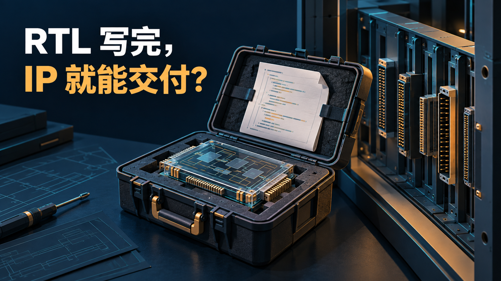
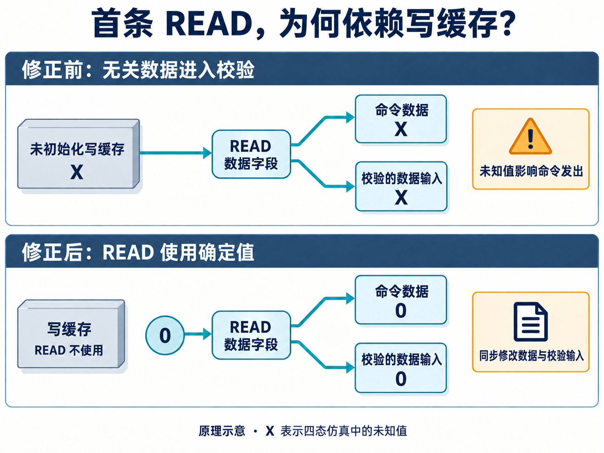
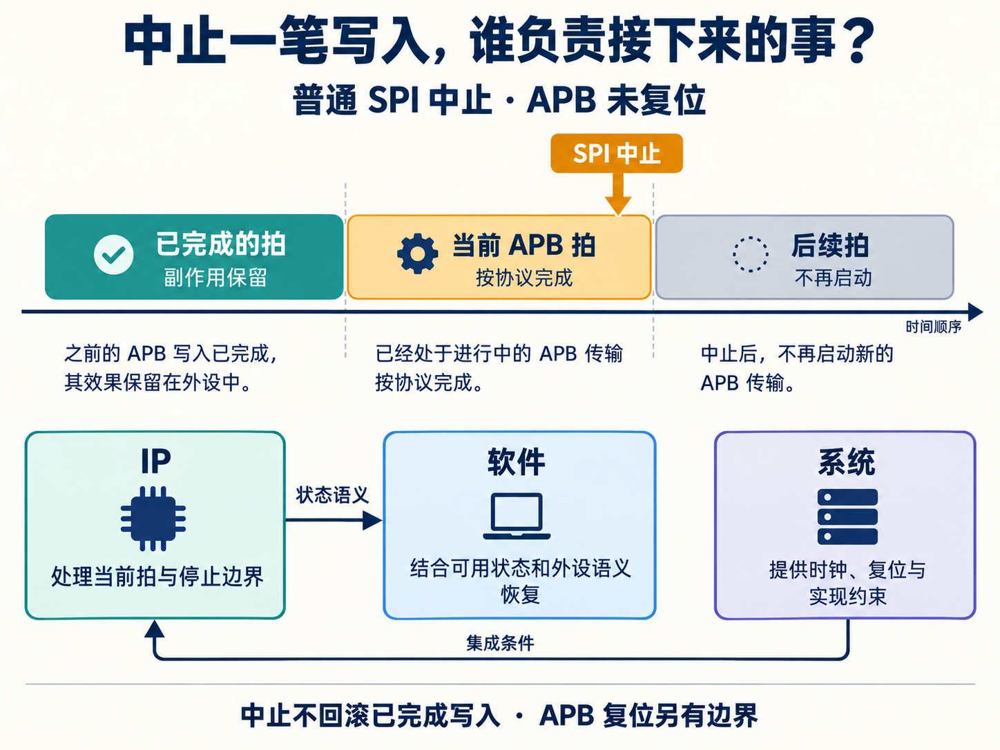
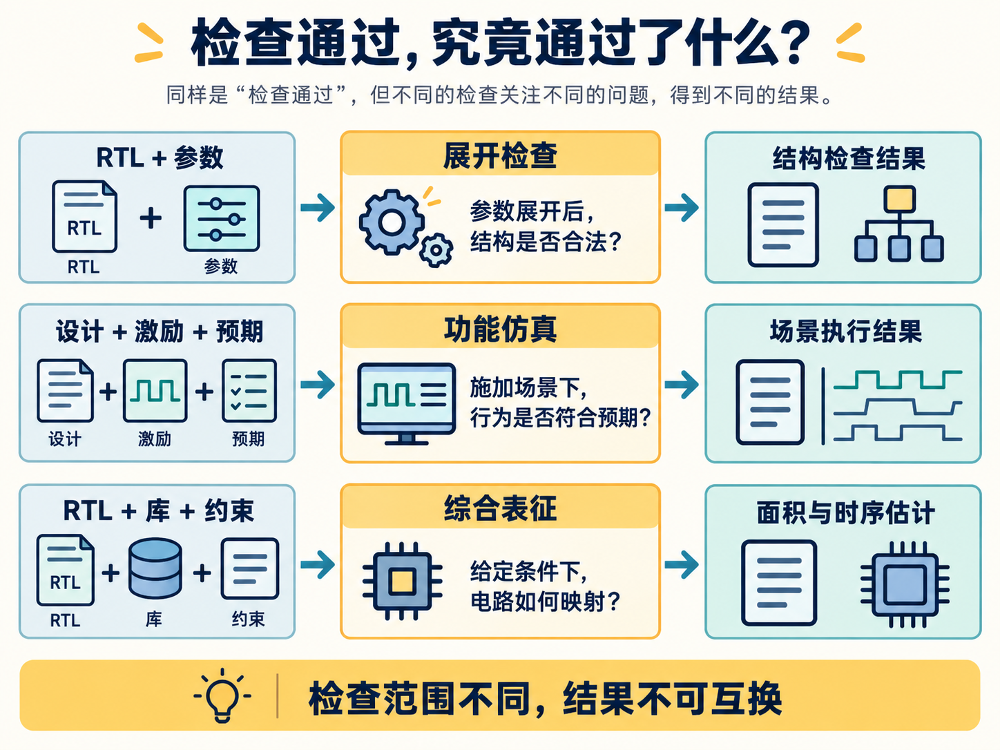

# 为什么 AI 写 RTL 容易，做一个真正可交付的 IP 很难？

简体中文 | [English](README.en.md)

让 AI 根据需求写一个计数器、一组寄存器，或者一段接口控制逻辑，是开始尝试 AI 辅助芯片研发的自然方式。有了 RTL，也就是描述电路状态与数据变化的代码，再搭起测试环境，便可以逐步检查基本功能。

如果正常读写已经跑通，接下来能不能把它作为 IP，交给其他项目复用？

接收方的使用顺序未必和测试一样。他可能上电就读，也可能在传输中途复位，还可能选择一个很少使用的参数组合。这些 **corner case（边界场景）是否仍然符合设计约定**，直接影响他能否放心接入这款 IP。

本文所说的“容易”，是指更容易获得候选实现，复杂 RTL 设计本身仍有难度。到了交付阶段，还需要把每个关键边界变成明确的行为规则，并留下实际检查结果。

沿着一款 SPI2APB 桥的真实首读故障，我们可以把这件事拆成四步：**找边界 → 定规则 → 做检查 → 明确保证范围。** 修复过的场景还要留在回归中，供后续修改继续检查。

## 第一步：从正常用法中，找出被默认成立的条件

SPI2APB 让外部控制器通过 SPI 串行接口，读写片内 APB 外设总线上的寄存器。一个很自然的测试顺序是：先写一个值，再读回来比较。

这个顺序检查了读写通路，却也带入了一个条件：第一次读取前，写路径已经运行过。

这款桥的研发记录中，增加内部命令奇偶校验后，上电后的第一笔 READ 曾经失败。READ 本来不需要写数据，命令准备逻辑却仍然从写缓存取值。

宽写缓存没有整体复位，尚未写入的位置在四态仿真中可能是 `X`，即未知值。奇偶校验需要根据受保护字段计算校验位，这份业务上用不到的数据也因此进入了检查路径。

上电直接 READ，暴露了对未初始化缓存的依赖；先写再读，则可能掩盖它。两种测试都在“测读取”，检查到的条件却不同。

这说明，找 corner case 可以从拆掉正常测试中的默认条件开始。把“先写后读”改成“上电直接读”，就得到了一个有明确目的的新场景。

同样的方法还可以沿着时间和参数边界展开：

| 从哪里找 | 要追问的条件 | 得到的候选场景 |
| --- | --- | --- |
| 初始化 | 操作是否依赖先前动作？ | 上电后直接 READ |
| 状态交接 | 两件事接近同时发生怎么办？ | 等待传输完成时中止 |
| 参数极值 | 最小配置是否改变结构？ | 最大拍数设为 1 |

这张表用于生成候选场景，执行结果还需逐项取得。AI 可以协助梳理组合；工程师结合状态机和数据依赖，判断哪些组合有意义、哪些风险值得优先检查。

## 第二步：先写清边界下应该发生什么

找到了场景，还需要有判断对错的依据。

对首读问题，规则很直接：READ 不应依赖写缓存中尚未初始化的数据。因此，这次修正让 READ 的命令数据取零，同时让奇偶校验中的数据输入也取零。

*图 1｜AI 生成的原理示意。这里只把校验中的数据输入置零，整个命令的校验值仍由全部受保护字段计算。X 表示仿真未知值，不是已经检出的比特翻转。*

只改命令数据、没有同步修改校验输入，仍可能造成两者不一致。这个看似很小的修复，要求沿着数据的使用路径一起检查。

有些边界则必须先做设计取舍。比如，一笔多拍写入中途被 SPI 控制器中止，已经发到 APB 总线上的传输怎么办？

这款桥规定：**普通 SPI 中止时，当前已启动的 APB 传输按协议完成，后续传输不再启动；已完成写入的副作用保留。** 中止一条命令不会撤销外设已经执行的动作。

*图 2｜AI 生成的事务边界示意。适用于 APB 未复位的普通 SPI 中止，不承诺在已中止的 SPI 帧内返回响应。*

如果发生的是 APB 自身复位，规则就不同：总线可能立即终止，外设可能已经执行写入，桥却还没有采样到完成。此时不能保证副作用尚未发生，也不能自动重放旧事务。软件需要结合恢复后的可用状态和外设语义处理。

所以，“支持中止”“支持复位”还不够具体。要落实到测试，就必须说明哪些动作允许完成、哪些动作必须停止，以及哪些结果暂时无法确定。AI 生成实现和测试之前，应共享这份经过审查的行为约定。

## 第三步：让测试真正制造这个条件，并检查后果

以首读为例，可以把建议的检查方案写成下面这张小表。它用于说明怎样设计测试，实际工程的复验结果在本节末尾单独交代。

| 检查环节 | 首读场景要落实的内容 |
| --- | --- |
| 制造条件 | 复位后不发写命令，直接 READ |
| 确认到达 | 记录首条命令确为 READ，之前没有写操作 |
| 判断结果 | 检查读取完成情况和返回值是否符合约定 |
| 确定预期 | 根据独立外设模型或寄存器约定取得预期值 |

最后一项尤其容易被忽略。如果测试直接复制待测实现的计算方法，两边可能一起算错，比较结果却仍然相同。

表中的“确认到达”，在并发事件中更容易漏掉。

名为“中止测试”的用例，可能总是在总线空闲时结束 SPI 帧。它即使通过，也没有回答“APB 正在等待完成时发生中止”的问题。需要通过波形、事件记录或覆盖点，确认中止确实落在目标状态，再检查当前传输和后续传输的行为。

这两件事应分别核对：**场景发生过，以及发生后的行为正确。** 覆盖点可以记录目标条件是否被触发；断言可以检查某项时序规则是否被违反。它们检查的内容同样需要来自设计约定。

AI 在这里可以帮助构造激励、编写检查、追踪失败。但如果实现和测试都沿用了“READ 前总会写一次”的假设，两份代码彼此一致，依然会漏掉首读问题。

SPI2APB 的工程记录保留了首读问题的定向复验，以及修复后的整组回归。前者针对已知反例，后者检查修改有没有影响其他已覆盖行为。保存这条用例，后续再修改缓存或校验路径时，才能继续检查同一个风险。

## 第四步：说明检查到哪里，保证才有边界

修好一个 corner case，并不意味着其他边界都已解决。测试结果需要和配置、场景、检查方法放在一起看。

这款 SPI2APB 有四个静态参数：APB3/APB4、16/32 位地址、1/16/64 的最大拍数，以及四种 SPI 模式，共 48 个合法组合。

保存的 0.1.0 版本报告中，有两个很容易混淆的结果：

| 报告中的结果 | 可以说明什么 |
| --- | --- |
| 48 个合法组合通过展开检查 | 这些参数组合能够形成合法结构 |
| 8 个配置的功能回归通过 | 这些配置中实际执行的场景通过检查 |

展开检查相当于先确认“这套参数能不能把电路构造出来”，功能仿真才继续检查“输入到来以后，它做得对不对”。**48 个组合能展开，不能写成 48 个组合的 corner case 都已验证。**

这 8 个配置覆盖 APB3、APB4 各四种 SPI 模式，并未遍历全部参数组合。APB3 使用 16 位地址，APB4 使用 32 位地址；模式 0～3 的最大拍数依次为 64、16、64、1。

上述记录使用 VCS W-2024.09-SP1、随机种子 17。本次写作引用保存的执行结果，未重新运行仿真。

*图 3｜AI 生成的检查范围示意。读图时关注每一行回答的问题；这些结果不能相互替代，也不是所有 corner case 已被覆盖的证明。*

同理，综合给出的面积和时序估计，也无法替代边界行为检查。换一个参数、换一套时钟和复位条件，需要重新判断现有证据是否适用。

如果要问“corner case 怎么保证”，工程上能够给出的答案应当具体到：支持哪些条件，要求什么行为，用哪些检查取得了什么结果，还有哪些地方缺少证据。单靠有限次仿真通过，无法推出所有状态组合都正确。

这份 SPI2APB 材料记录了 IP 级设计、功能验证和综合工作，但完整覆盖收敛、高级跨时钟域／复位域检查及物理时序签核仍有未完成项。因此，本文用它说明发现和修正边界问题的方法，不把它当作无条件正式发布的证明。

## 交付时，要把这套检查方法一起留下

回到首读案例，值得保留下来的有一条完整关系：READ 不需要写数据，却意外依赖了写缓存；通过定义无效载荷并同步修改校验输入消除了依赖；用上电直接读取的场景检查修复，再运行回归。

这条关系比“首读已修复”更有用。下一次修改缓存、复位或校验逻辑时，维护者能知道该重新检查什么，以及为什么。

AI 可以参与其中的每一步：找出隐含条件、展开边界组合、落实行为规则、生成测试，再根据工具反馈修改。Skill 可以保存这套工作方法，仓库可以保存用例和配置，工程师则负责审查预期与证据是否相称。

一款 IP 交到下一个项目时，这些内容应随 RTL 一起交接。接收方才能判断自己的配置是否在已有检查范围内，遇到新的使用条件时，又该从哪里补充验证。

下一次让 AI 修改 RTL 时，我会把相应的边界规则和回归用例一并交给它。改动完成后，再检查这些条件是否仍然成立。这样，已经发现的 corner case 才能成为后续研发可以继续使用的保障。
